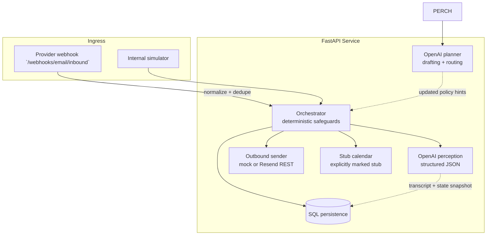

## Scrini AI — Email Wake-Up Agent

Autonomous recruiter-style email loop that persists full threads, negotiates strictly inside configurable budgets, and handles **cancellation → reschedule loops** indefinitely while keeping persona continuity. Built as an AI full-stack submission: typed Python service, persisted memory (SQLite locally, Postgres container), dual-stage LLM calls (perception → planning), deterministic guardrails for finance + booking, and webhook-ready ingress.

### Highlights

| Layer | What ships |
|-------------|------------|
| **Perception** | Structured extraction + intent taxonomy (`ProspectIntent`, cancellation detection, objection capture, numeric hourly reads). |
| **Planning/drafting** | Second LLM call grounded in transcript + canonical memory JSON + enumerated stub slots. |
| **Action** | Resend-compatible outbound gateway with mock toggle, deterministic stub calendar validations, Postgres/SQLite storage. |
| **HTTP** | `POST /v1/agent/outreach`, Resend-/Mailgun-ish `POST /webhooks/email/inbound`, deterministic `POST /internal/simulations/...` for scripted demos sans MX plumbing. |

### Architecture



### Operational flow (per inbound turn)

1. Append inbound mail with normalized `Message-Id` + `In-Reply-To`.
2. Rebuild chronological transcript (`AGENT` / `PROSPECT`).
3. **Perception**: classify intent & extract signals (cancellation, rates, objections, proposed times).
4. **Deterministic overlays**: cancel bookings when needed, escalate reschedule phase, arithmetic budget disqualification (`min(rate) > ceiling`).
5. **Planner** (skipped only on hard declines / impossible budgets): emits `reply_plaintext`, `internal_action`, optional `negotiation_offer_usd_hour`, optional `slot_iso_to_book`.
6. **Booking guard**: confirmations must match enumerated stub RFC3339 strings from config (swap this module with Google Calendar or Cal.com in production — already isolated).
7. Persist outbound transcript + materially updated conversation JSON state.

### Configuration

Duplicate `.env.example` → `.env` and populate secrets at minimum (`OPENAI_API_KEY`). Presets (`DEFAULT_AGENT_PRESET`) map to dictionaries in `app/config.py` — extend `_AGENT_PRESETS` rather than scattering literals.

Key env vars:

- `DATABASE_URL` — SQLite default `./data/wakeup.db` or `postgresql+psycopg://…` for Docker Compose.
- `MOCK_EMAIL` — `true` logs pretend sends (great for Scrini demos); flip `false` + `RESEND_API_KEY` for real SMTP-free delivery.
- `STUB_AVAILABLE_SLOTS_ISO` — comma-separated RFC3339 strings used by deterministic calendar stub.
- `WEBHOOK_SECRET` — optional `X-Webhook-Secret` expectation for webhook hardening demos.

### Local development

```bash
cd scrini-email-wakeup-agent
python -m venv .venv && source .venv/bin/activate  # Windows: .venv\\Scripts\\activate
pip install -e ".[dev]"
cp .env.example .env

export OPENAI_API_KEY=...
uvicorn app.main:app --reload --host 0.0.0.0 --port 8000
```

Smoke tests:

```bash
pytest
```

Docker (Postgres + API):

```bash
export OPENAI_API_KEY=sk-...
docker compose up --build
```

(`MOCK_EMAIL` defaults to true inside compose YAML for repeatable CI-style demos.)

### Demo script (manual)

1. `POST /v1/agent/outreach` with `{ "prospect_email": "you+rando@yourdomain.com" }`
2. `POST /internal/simulations/{id}/inbound` repeatedly with scripted bodies negotiating, booking stub slots (`2026-05-13T16:30:00+00:00`), cancelling, confirming another slot (`2026-05-14T10:00:00+00:00`), repeating N times — observe `booking_history`. 
3. `GET /internal/conversations/{id}` for raw transcript/state dump suitable for Scrini reviewer walkthrough.

### Trade-offs consciously taken

| Choice | Upside | Cost |
|---------|--------|-----|
| Two LLM hops vs mono-call | Modular evals / easier counterfactual testing on perception alone | Extra latency+cost (~2× completions) |
| SQL JSON state blobs | Extremely fast iteration, keeps memory human-inspectable | Needs migration discipline vs pure relational decomposition |
| Deterministic budgeting shortcut | Eliminates hallucinated concessions | Narrow “creative negotiation path” autonomy |
| Stub calendar | Ships without OAuth dance | Operators must stitch real ICS provider before prod traffic |

### Email provider notes

- **Outbound**: Resend HTTPS API (`app/email/send.py`). Swap SES/Mailgun by implementing parallel sender without touching orchestrator.
- **Inbound**: `parse_generic` tolerates permissive payloads; tighten by mapping your vendor’s webhook signature verifier inside `router.inbound_email_provider_webhook`.

### Sample transcripts / Loom blueprint

Synthetic narrative transcripts live under `docs/transcripts/`:

1. `01-successful_negotiation_and_booking.md`
2. `02-cancellation_and_rebooking_loop.md`
3. `03-graceful_walk_away_budget.md`

For the requested Loom: walk architecture diagram (above), show live `POST` sequence + `GET` transcript after a forced reschedule, narrate where perception vs planner JSON lands in logs (MOCK email lines). That satisfies the “live demo + reschedule loop” requirement without waiting on DNS.

### Testing strategy

- `tests/test_state_machine.py` — pure numerical + state transition coverage (no network).
- Layer live OpenAI integration tests behind `RUN_LIVE_OPENAI=1` if you extend the suite; default CI stays hermetic.

### License

Submission artifact — confirm with Scrini before external reuse.
