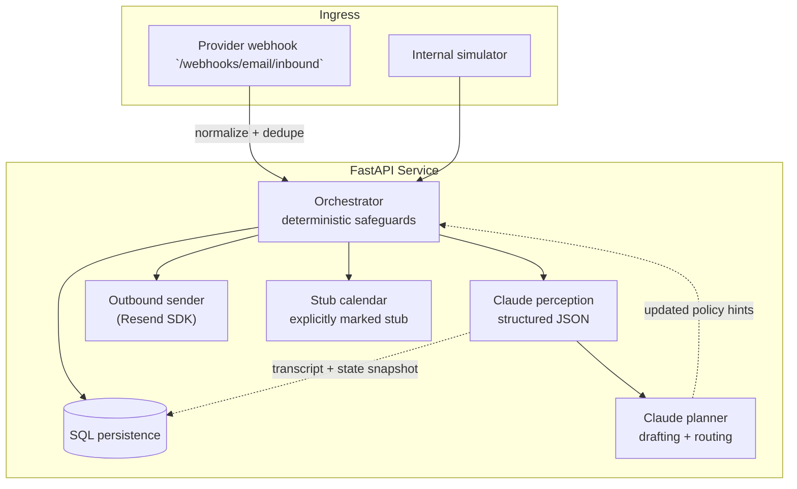

## Scrini AI — Email Wake-Up Agent

Autonomous recruiter-style email loop that persists full threads, negotiates strictly inside configurable budgets, and handles **cancellation → reschedule loops** indefinitely while keeping persona continuity. Built as an AI full-stack submission: typed Python service, persisted memory (SQLite locally, Postgres container), dual-stage LLM calls (perception → planning), deterministic guardrails for finance + booking, and webhook-ready ingress.

### Highlights

| Layer | What ships |
|-------------|------------|
| **Perception** | Structured extraction + intent taxonomy (`ProspectIntent`, cancellation detection, objection capture, numeric hourly reads). |
| **Planning/drafting** | Second LLM call grounded in transcript + canonical memory JSON + enumerated stub slots. |
| **Action** | Resend outbound (SDK); deterministic stub calendar validations; Postgres/SQLite storage. |
| **HTTP** | `POST /v1/agent/outreach`, Resend-/Mailgun-ish `POST /webhooks/email/inbound`, deterministic `POST /internal/simulations/...` for scripted demos sans MX plumbing. |

### Architecture



### Operational flow (per inbound turn)

1. Append inbound mail with normalized `Message-Id` + `In-Reply-To`.
2. Rebuild chronological transcript (`AGENT` / `PROSPECT`).
3. **Perception**: classify intent & extract signals (cancellation, rates, objections, proposed times).
4. **Deterministic overlays**: cancel bookings when needed, escalate reschedule phase, and run `compute_negotiation_move()` — a pure function that owns the concession ladder (anchor → counter → hold-at-cap → walk-away) given `budget_target / budget_floor / budget_ceiling / concession_step / negotiation_max_rounds / negotiation_style`.
5. **Planner** (skipped only on hard declines): receives the `NEGOTIATION_DIRECTIVE` (posture + recommended_offer_usd_hour) and emits `reply_plaintext`, `internal_action`, optional `negotiation_offer_usd_hour`, optional `slot_iso_to_book`. The orchestrator then **forces** the planner output to obey the directive: it overwrites `negotiation_offer_usd_hour` with the recommended number and flips `internal_action` to `walk_away_budget` when the strategy says so. LLM owns prose; deterministic code owns money and the close.
6. **Booking guard**: confirmations must match enumerated stub RFC3339 strings from config (swap this module with Google Calendar or Cal.com in production — already isolated).
7. Persist outbound transcript + materially updated conversation JSON state.

### Configuration

Duplicate `.env.example` → `.env` and populate secrets at minimum (`ANTHROPIC_API_KEY`, `RESEND_API_KEY`). Presets (`DEFAULT_AGENT_PRESET`) map to dictionaries in `app/config.py` — extend `_AGENT_PRESETS` rather than scattering literals.

Key env vars:

- `DATABASE_URL` — SQLite default `./data/wakeup.db` or `postgresql+psycopg://…` for Docker Compose.
- `RESEND_API_KEY` — **required** for any outbound email (no mock / pretend-send mode).
- **Resend sandbox (no custom domain)** — set `EMAIL_FROM` to `… <onboarding@resend.dev>`, add your inbox as an allowed test recipient in the Resend dashboard, and use that same address as `prospect_email` in `/v1/agent/outreach` so messages actually arrive while you iterate.
- **`SANDBOX_ALLOWED_TO_EMAILS`** — optional comma-separated allowlist (e.g. your single Gmail); when set, `/v1/agent/outreach` and every outbound send must target one of those addresses so you cannot accidentally mail someone else during demos.
- `STUB_AVAILABLE_SLOTS_ISO` — comma-separated RFC3339 strings used by deterministic calendar stub.
- `WEBHOOK_SECRET` — optional `X-Webhook-Secret` expectation for webhook hardening demos.
- `ANTHROPIC_MODEL` — defaults to `claude-sonnet-4-6`; set `claude-opus-4-6` (or another id from `/v1/models`) if you prefer.

### Local development

```bash
cd /path/to/this-repo  # repository root (e.g. scr-practice)
python -m venv .venv && source .venv/bin/activate  # Windows: .venv\\Scripts\\activate
pip install -e ".[dev]"
cp .env.example .env

export ANTHROPIC_API_KEY=sk-ant-api03-...
export RESEND_API_KEY=re_...
uvicorn app.main:app --reload --host 0.0.0.0 --port 8000
```

Use **http://localhost:8000/docs** (OpenAPI) for interactive requests against the same API your ngrok tunnel exposes.

Smoke tests:

```bash
pytest
```

Docker (Postgres + API):

```bash
export ANTHROPIC_API_KEY=sk-ant-api03-...
docker compose up --build
```

Postgres uses a compose-scoped Docker volume (`scr_practice_wakeup_pg`). For a **fresh empty database**:

```bash
docker compose down -v
docker compose up --build
```

With Docker Compose, the API **`env_file`** loads `.env`; set **`RESEND_API_KEY`** there for real sends. Restart containers after editing `.env`.

### Demo script (manual)

1. `POST /v1/agent/outreach` with `{ "prospect_email": "you+rando@yourdomain.com" }`
2. `POST /internal/simulations/{id}/inbound` repeatedly with scripted bodies negotiating, booking stub slots (`2026-05-13T16:30:00+00:00`), cancelling, confirming another slot (`2026-05-14T10:00:00+00:00`), repeating N times — observe `booking_history`. 
3. `GET /internal/conversations/{id}` for raw transcript/state dump suitable for Scrini reviewer walkthrough.

### Trade-offs consciously taken

| Choice | Upside | Cost |
|---------|--------|-----|
| Two LLM hops vs mono-call | Modular evals / easier counterfactual testing on perception alone | Extra latency+cost (~2× completions) |
| SQL JSON state blobs | Extremely fast iteration, keeps memory human-inspectable | Needs migration discipline vs pure relational decomposition |
| Budget guardrails | Deterministic concession ladder (`anchor → counter_under_cap → hold_at_cap → walk_away`) computed in pure code; planner gets a `NEGOTIATION_DIRECTIVE` and the orchestrator overwrites both the numeric offer and the walk-away action so the LLM cannot drift on money or rounds | Negotiation prose still depends on LLM quality; tone may need preset-level tuning |
| Stub calendar | Ships without OAuth dance | Operators must stitch real ICS provider before prod traffic |

### Email provider notes

- **Outbound**: Official **Resend Python SDK** (`import resend` / `resend.Emails.send` in `app/email/send.py`; set `RESEND_API_KEY` — replace `re_xxxxxxxxx` in `.env` with your real key). Swap SES/Mailgun by implementing a parallel sender without touching the orchestrator.
- **Inbound**: `POST /webhooks/email/inbound` — Resend **`email.received`** events carry metadata only; the handler calls **`resend.Emails.Receiving.get(email_id)`** to load `text`/`html` before running the agent (see `app/email/webhook_adapters.py`). Tunnel with **ngrok** using the **full** HTTPS URL, e.g. `https://YOUR-SUBDOMAIN.ngrok-free.app/webhooks/email/inbound`.
- **Reply routing**: Set **`EMAIL_REPLY_TO`** to your `*@*.resend.app` receiving route. **`EMAIL_MIRROR_REPLY_TO_IN_CC`** (default **`false`**): mirrors that address into **Cc** for Gmail **Reply all** — **requires a verified Resend sending domain**, because **`onboarding@resend.dev` test sends may only include your personal test inbox as `to`/`cc`/`bcc` (extra Cc ⇒ Resend rejects the send)**. Optional **`EMAIL_CC`** adds more Cc when your account allows those recipients.

### Sample transcripts / Loom blueprint

Synthetic narrative transcripts live under `docs/transcripts/`:

1. `01-successful_negotiation_and_booking.md`
2. `02-cancellation_and_rebooking_loop.md`
3. `03-graceful_walk_away_budget.md`

For the requested Loom: walk architecture diagram (above), show live `POST` sequence + `GET` transcript after a forced reschedule, narrate where perception vs planner JSON and Resend send logs land in the API output. That satisfies the “live demo + reschedule loop” requirement without waiting on DNS.

### Testing strategy

- `tests/test_state_machine.py` — pure numerical + state transition coverage (no network).
- Layer live Anthropic integration tests behind `RUN_LIVE_ANTHROPIC=1` if you extend the suite; default CI stays hermetic.

### License

Submission artifact — confirm with Scrini before external reuse.
